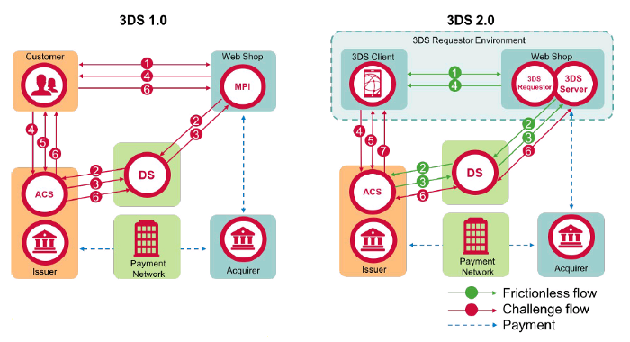
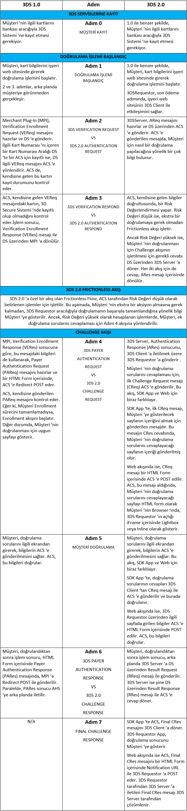
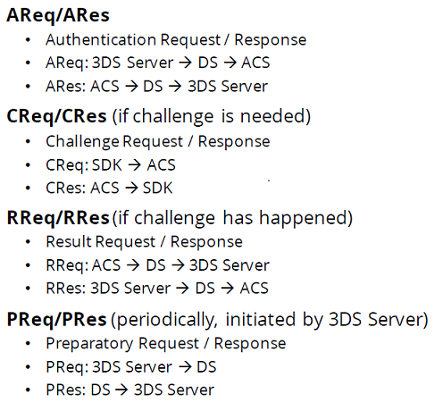
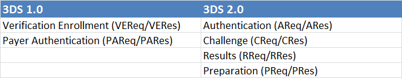

# 3D

## Özetle 3 domain nedir ?

**Acquirer Domain** : İş yerlerini ve bunların çalıştığı bankaları bulundurur.  
 Components:  
- MPI (Merchant Server Plug-in), 
- 3DS Requestor Envionment (3DS Requestor, 3DS Server, 3DS Client)
- 3DS Integrator  

**Issuer Domain** : Ödemede kullanılan kartlar ve bu kartların basıldığı bankaları bulundurur.  
Components: 
- ACS ( Access Control Server)

**Interoperability Domain** : Bu iki domain arasında iletişimi sağlar ve kart bileşenlerinin şemasını tutar.   
Components: 
- DS (Directory Server),
- DS CA (Directory Server Certificate Authority)
- Authentication History (AH)

## Issuer bankalar ?

## 1- Issuer Domain
### ACS ( Access Control Server)
İlgili issuer bankaların belirlediği kurallar ve yöntemlerle kart hamillerinin doğrulanmasını sağlar.

- İlgili kartın kayıtlı ve doğrulanabilir olup olmadığını kontrol eder.
- Issuer bankanın belirlediği yöntemlerle kart hamilini(card holder) doğrular. (**Challenge**)

3DS 2.0'da Challenge iki aşamada gerçekleşir;
- Bir risk doğrulaması yaparak **Frictionless** akışları sonrası işlemi **challenge** a girmeden tamamlayabilir. 
- Sadece ödeme işlemleri için değil, **non-payment** içinde 3DS doğrulama akışı gerçekleştirilebilir.

## 2-Interoperability Domain
### Directory Server (DS)
*Acquirer Domain* ile *Issuer Domain* arasındaki bağlantıyı sağlar.  
Bir 3DS işlemi *Acquirer Domain*'deki 3DS Server/MPI ile başlar, ancak bu bileşende kart bilgilerinin doğrulamasının yapılacağı ACS'in bilgileri bulunmamaktadır. Bu sebeple öncelikle işlemler DC'lere yönlendirilir.

3DS 1.0 DS'lerin görevleri :
- İlgili merchant'ın DS'te kayıtlı olup olmadığını doğrulamak,
- İşlemde kullanılan kart için kart aralığını içeren bir **ACS**'in olup olmadığını kontrol etmek
- İşlemi **ACS**'e yönlendirmek ve **ACS**'ten aldığı bilgiyi **MPI**'a dönmek.

### Directory Server Certificate Authority (DC CA)
- MPI - DS  ve DS -ACS arasında yapılan TLS haberleşmesinde kullanılan sertifikaları imzalayan *Certificate Authority*'lerdir.

### Authentication History Server (AHS)

3DS 1.0 akışında, kart hamili doğrulama sonucu (PARes), **ACS**'ten **MPI**'a doğrudan gönderildiğinden 3DS sonucu kart şemaları tarafından bilinememektedir. **ACS**'ler 3DS işlem sonucunu asekron bir şekilde **AHS**'e göndermektedir.

3DS 2.0 da bu bileşen kaldırılmıştır.

## Acquirer Domain
### Merchant Server Plug-In (MPI)
3DS 1.0 akışında , E-Ticaret web sitelerinin 3DS akışını başlatabilmek için entegre olduğu ve akışı başlattığı bileşendir.
Rolleri;
- 3DS akışı için gerekli olan bilgileri toplamak
- İş yeri bilgilerini kontrol etmek
- **DS**'e göndermek üzere VEReq mesajını hazırlamak ve iletmek,
- ***ACS***'e yönlendirmek üzere PAReq mesajını hazırlamak ve iletmek,
- ***ACS***'den dönen Kart Hamili doğrulama sonucunun geçerliliğini kontrol edip, 3DS Requestor'a yönlendirmek
3DS 2.0 da bu bileşenin adı 3DS Server olarak değiştirilmiştir.

## 3D 2.0 daki değişiklikler ?

### 1- Frictionless Akış
Risk bazlı doğrulama. ACS'de bulunan risk modülleri Issuer banka'ların tanımladığı kurallar doğrultusunda ek bir doğrulama(OTP) gerekmeden 3DS i sonlandırabilir.  
**Örnekler:**
- Mobil bir cihazla,
- Yurt içinde,
- "ABC" iş yerinden
- Son 3 ayda en az 1 OTP doğrulama yapılmış ve en az 3 başarılı işlemi bulunan bir kart ile,
- 100 TL altındaki işlemler

### 2-Non payment işlemler için 3D
3DS 1.0 da doğrulama işlemi sadece ödeme için gerçekleştiriliyordu.  
3DS 2.0 da kartı Digital Cüzdana eklemek için doğrulama yapılabilir.

### 3- Mobil uyumluluk ve Mobil SDK
- Mobil cihazlardan yapılan ödemelerde daha az sorun yaşamak için mobil uyumlu olması sağlandı.
- Native entegrasyon için SDK bulunmaktadır.

### 4- Alternatif Doğrulama Yöntemi
OTP 'nin haricinde;
- Parmak izi,
- Ses
- Yüz tanıma
- Biyometrik Doğrulama teknolojilerinin kullanılması mümkün.

### 5- Mesaj Standartları
XML yerine JSON kullanılıyor.

## 3D Messages 1.0 vs 2.0 

## HALF 3D SECURE nedir?
Üye iş yerinin 3D Secure işlemi desteklerken kartın desteklememesi durumudur.

## CAVV ve AVV nedir ?
3D Secure işlemlerde işlem bütünlüğünün ve güvenliğinin sağlanması için kullanılan kodlardır.
CAVV mastercard için,  
AVV visa için kullanılır.  
**CAAV** -> Cardholder Authentication Verification Value  
**AVV** -> AccountHolder Authentication Value

## ACS (Access Control Server) nedir ?
ilgili Issuer bankaların belirlediği kurallar ve yöntemlerle kart hamillerinin doğrulanmasını sağlar.
ACS ‘in 3DS 1.0 ‘da iki temel fonksiyonu vardır :
İlgili kartın kayıtlı ve doğrulanabilir olup olmadığını kontrol eder.
Issuer bankanın belirlediği yöntemler ile kart hamilini doğrular. (Challenge)

## On-Us nedir ?
Kartı veren banka ile pos sahibi banka aynı ise **On-Us**'tır, değilse **Not On-Us**'tır

## EMV nedir ?
- Europay Mastercard Visa kelimelerinin kısaltmasından oluşur.  
- EMV, çip kartı teknolojisi kullanılan kredi ve banka kartları ödemelerini düzenleyen uluslararası standarttır
-  bir ödeme terminalinde mikroişlemci entegre edilmiş kartlarla ödeme yapılabilmesini sağlamaktır.

Avantajları;
- ”CHIP and PIN” uygulaması kart dolandırıcılığının artmasına karşı bir çözüm olarak tanıtılmıştır. 
- CHIP uygulaması kartın kopyalanmasının önüne geçerken, PIN işlemi çalınmış kartların kötüye kullanımını engellemektedir. 
- Manyetik şeritli kartlarla yapılan işlemler online provizyon ile onaylanmaktadır. Bu işlem, hem bağlantı aşamasında zaman kaybı oluşturmakta hem de işlem maliyetini arttırmaktadır.

## HSM nedir ?

Hardware Security Module ifadesinin kısaltması olan HSM, hassas kriptografik anahtarları fiziksel ortamda saklamak ve kriptografik işlemleri en güvenli şekilde gerçekleştirmek için üretilmiş özel güvenlik donanımlarıdır. Bu donanımlar uygulamaların güvenli bir şekilde çalışmasını sağlarlar.

Kullanım alanları:
- Bankacılık,
- E-imza sistemleri
- E-devlet sistemleri,
- E-pasaport islemleri
- Biletleme sistemleri
- İstihbarat ve Güvenlik birimleri

HSMler hangi amaçla kullanılmaktadır?

- Güvenli Veri Depolama
- Güvenli Veri Transferi
- Doğrulama/Authentication
- İz Takibi
- Veri Bütünlüğü

Fraud ?

Wallet nedir ? 
https://unalarif.com/yazi/wallet-nedir/

Financial technology (FinTech) nedir ?

KEK(Key Encryption Key) nedir?
https://unalarif.com/yazi/kekkey-encryption-key-nedir/