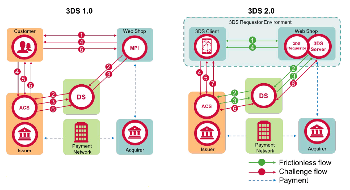
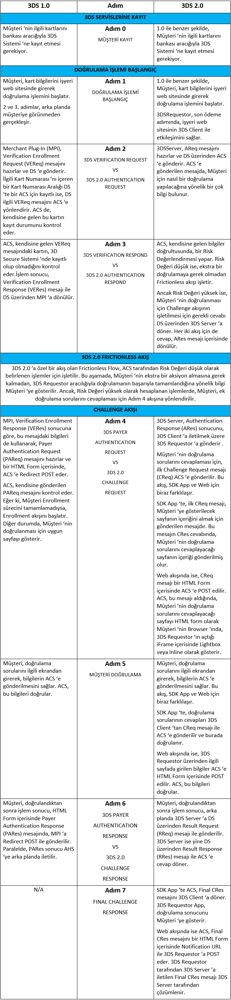
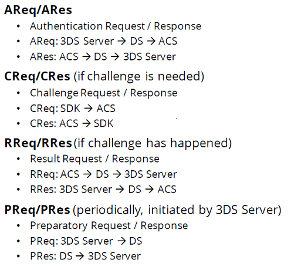

# 3D

## Özetle 3 domain nedir ?

**Acquirer Domain** : İş yerlerini ve bunların çalıştığı bankaları bulundurur.  
 Components:  
- MPI (Merchant Server Plug-in), 
- 3DS Requestor Envionment (3DS Requestor, 3DS Server, 3DS Client)
- 3DS Integrator  

**Issuer Domain** : Ödemede kullanılan kartlar ve bu kartların basıldığı bankaları bulundurur.  
Components: 
- ACS ( Access Control Server)

**Interoperability Domain** : Bu iki domain arasında iletişimi sağlar ve kart bileşenlerinin şemasını tutar.   
Components: 
- DS (Directory Server),
- DS CA (Directory Server Certificate Authority)
- Authentication History (AH)

## Issuer bankalar ?

## 1- Issuer Domain
### ACS ( Access Control Server)
İlgili issuer bankaların belirlediği kurallar ve yöntemlerle kart hamillerinin doğrulanmasını sağlar.

- İlgili kartın kayıtlı ve doğrulanabilir olup olmadığını kontrol eder.
- Issuer bankanın belirlediği yöntemlerle kart hamilini(card holder) doğrular. (**Challenge**)

3DS 2.0'da Challenge iki aşamada gerçekleşir;
- Bir risk doğrulaması yaparak **Frictionless** akışları sonrası işlemi **challenge** a girmeden tamamlayabilir. 
- Sadece ödeme işlemleri için değil, **non-payment** içinde 3DS doğrulama akışı gerçekleştirilebilir.

## 2-Interoperability Domain
### Directory Server (DS)
*Acquirer Domain* ile *Issuer Domain* arasındaki bağlantıyı sağlar.  
Bir 3DS işlemi *Acquirer Domain*'deki 3DS Server/MPI ile başlar, ancak bu bileşende kart bilgilerinin doğrulamasının yapılacağı ACS'in bilgileri bulunmamaktadır. Bu sebeple öncelikle işlemler DC'lere yönlendirilir.

3DS 1.0 DS'lerin görevleri :
- İlgili merchant'ın DS'te kayıtlı olup olmadığını doğrulamak,
- İşlemde kullanılan kart için kart aralığını içeren bir **ACS**'in olup olmadığını kontrol etmek
- İşlemi **ACS**'e yönlendirmek ve **ACS**'ten aldığı bilgiyi **MPI**'a dönmek.

### Directory Server Certificate Authority (DC CA)
- MPI - DS  ve DS -ACS arasında yapılan TLS haberleşmesinde kullanılan sertifikaları imzalayan *Certificate Authority*'lerdir.

### Authentication History Server (AHS)

3DS 1.0 akışında, kart hamili doğrulama sonucu (PARes), **ACS**'ten **MPI**'a doğrudan gönderildiğinden 3DS sonucu kart şemaları tarafından bilinememektedir. **ACS**'ler 3DS işlem sonucunu asekron bir şekilde **AHS**'e göndermektedir.

3DS 2.0 da bu bileşen kaldırılmıştır.

## Acquirer Domain
### Merchant Server Plug-In (MPI)
3DS 1.0 akışında , E-Ticaret web sitelerinin 3DS akışını başlatabilmek için entegre olduğu ve akışı başlattığı bileşendir.
Rolleri;
- 3DS akışı için gerekli olan bilgileri toplamak
- İş yeri bilgilerini kontrol etmek
- **DS**'e göndermek üzere VEReq mesajını hazırlamak ve iletmek,
- ***ACS***'e yönlendirmek üzere PAReq mesajını hazırlamak ve iletmek,
- ***ACS***'den dönen Kart Hamili doğrulama sonucunun geçerliliğini kontrol edip, 3DS Requestor'a yönlendirmek
3DS 2.0 da bu bileşenin adı 3DS Server olarak değiştirilmiştir.

## 3D 2.0 daki değişiklikler ?